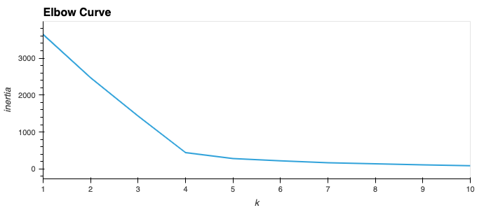
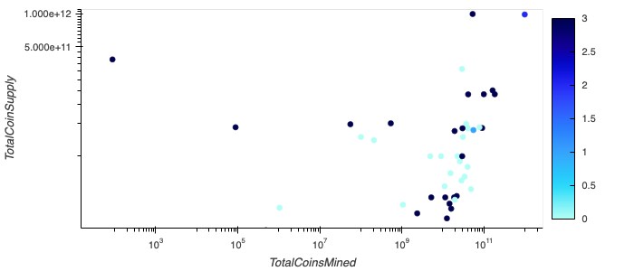
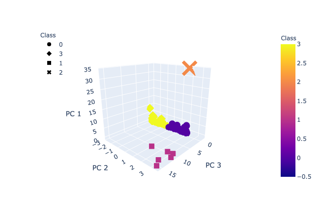

<!-- header is made with: https://github.com/kyechan99/capsule-render -->

[Illya Nayshevsky, Ph.D.](http://www.illya.bio) [](https://www.linkedin.com/in/illyanayshevskyy/)

<br>
Columbia FinTech Bootcamp Assignment

---

### Table of Contents
* [Overview](#overview)
* [Requirements](#requirements)
* [Data](#data)
* [Clustering Using K-Means](#clustering-using-k-means)
    * [Methods](#methods)
    * [Results](#results)

---

## Overview

All tradable cryptocurrencies were clustered using the K-means model, the clusters were visualized and discussed. K-means clustering is a method of vector quantization where n observations are fit into k clusters in which each observation belongs to the cluster with the nearest mean [Wiki](https://en.wikipedia.org/wiki/K-means_clustering). K-means is closely related to k-nearest neighbors. 

The most common algorithm uses an iterative refinement technique, pictured below.


1. k initial "means" (in this case k=3) are randomly generated within the data domain (shown in color).


2. k clusters are created by associating every observation with the nearest mean. The partitions here represent the Voronoi diagram generated by the means.


3. The centroid of each of the k clusters becomes the new mean.


4. Steps 2 and 3 are repeated until convergence has been reached.


*All images were obtained from [Wikipedia](https://en.wikipedia.org/wiki/K-means_clustering)*


## Requirements

A new conda environment and Jupyter Notebook/Lab should be used. Data visualization is done with Plotly and hvPlot.


```python
conda install -c conda-forge jupyterlab

pip install pandas
pip install matplotlib
pip install -U scikit-learn

conda install hvplot
conda install -c plotly plotly
conda install -c plotly plotly_express

conda install -c conda-forge nodejs
conda update nodejs
```

For Jupyter Notebook support:

```python
conda install "notebook>=5.3" "ipywidgets>=7.5"
```

For Jupyter Lab support:

```python
conda install jupyterlab "ipywidgets>=7.5"

# JupyterLab renderer support
jupyter labextension install jupyterlab-plotly@4.14.3

# OPTIONAL: Jupyter widgets extension
jupyter labextension install @jupyter-widgets/jupyterlab-manager plotlywidget@4.14.3
```

[Node.js v14.17.0](https://nodejs.org/en/) or higher is required to build Jupyter Lab Extensions.

The instructions on how to update Node.js can be found here: [How to Easily Update Node.js to the Latest Version](https://www.whitesourcesoftware.com/free-developer-tools/blog/update-node-js/)


---
 
## Data

1. Cryptocurrency data was obtained from using [CryptoCompare API](https://min-api.cryptocompare.com/documentation?key=Historical&cat=DailyHistoMinute). 

2. The following columns within the dataset were used in the analysis:

```python
['CoinName','Algorithm','IsTrading','ProofType','TotalCoinsMined','TotalCoinSupply']
```

3. The dataset was filtered by:
    * <code>IsTrading</code> is <code>True</code>
    * <code>ProofType</code> is not <code>"N/A"</code>
    * <code>Null</code> values were removed
    * <code>TotalCoinsMined</code> > <code>0</code>

4. <code>CoinName</code> column was isolated.

5. Non-numerical values were encoded.

```python
df_encoded = pd.get_dummies(df, columns=['Algorithm','ProofType'])
```

6. All data was scaled.

```python
from sklearn.preprocessing import StandardScaler, MinMaxScaler

df_scaled = StandardScaler().fit_transform(df_encoded)
```

7. Dimentionality was reduced to 3 principal components.

```python
from sklearn.decomposition import PCA

pca = PCA(n_components=3)
crypto_pca = pca.fit_transform(df_scaled)
```

The resulting dataset presents the following appearance:


|      | Algorithm | IsTrading | ProofType | TotalCoinsMined | TotalCoinSupply |
|----:|:---------:|:---------:|:---------:|:---------------:|:---------------:|
|  42 |   Scrypt  |    True   |  PoW/PoS  |   4.199995e+01  |        42       | 
| 404 |   Scrypt  |    True   |  PoW/PoS  |   1.055185e+09  |    532000000       


---

## Clustering Using K-Means

Given a set of observations (x1, x2, ..., xn), where each observation is a d-dimensional real vector, k-means partitions the n observations into k (≤ n) sets so as to minimize the within-cluster sum of squares (WCSS) (i.e. variance). [Wiki](https://en.wikipedia.org/wiki/K-means_clustering)

### Computational Methods

Given an initial set of k means m1(1),...,mk(1), the algorithm proceeds by alternating between two steps:

**1. Assignment step** - Assign each observation to the cluster with the nearest mean: that with the least squared Euclidean distance. (Mathematically, this means partitioning the observations according to the Voronoi diagram generated by the means.) [Wiki](https://en.wikipedia.org/wiki/K-means_clustering)

**2. Update step:** - Recalculate means (centroids) for observations assigned to each cluster. [Wiki](https://en.wikipedia.org/wiki/K-means_clustering)

The iterations of the k-means algorithm are visualized below:


### Determining Best Value for *k*

The best value for *k* was determined by calculating inertia for each potential value of *k*.

```python
from sklearn.cluster import KMeans

inertia = []
k = list(range(1, 11))

for i in k:
    km = KMeans(n_clusters=i, random_state=0)
    km.fit(pcs_df)
    inertia.append(km.inertia_)
```

From the resulting elbow curve diagram it was determined that *k* = 4 was optimal.



### K-Means Clustering Result

K-means model was then instantiated and fir with *k*=4.

```python
# Initialize the K-Means model
model = KMeans(n_clusters=4, random_state=0)

# Fit the model
model.fit(df)

# Predict clusters
pred = model.predict(df)
```

The results were then visualized:

The table of total tradable crypto-currencies shows that the clusters are spread out along the <code>TotalCoinSupply</code> / <code>TotalCoinsMined</code> slope, seemingly undifferenciated.




But, if we look at the Principal Component 3D Scatter plot where *x*, *y*, and *z* are Principal Components 1, 2, and 3 respectively, it is evident that the data is in-fact clustered properly. The ambiguity of the Principal Components restricts from identifying the underlying data, and from plotting the results on raw data axes. 




